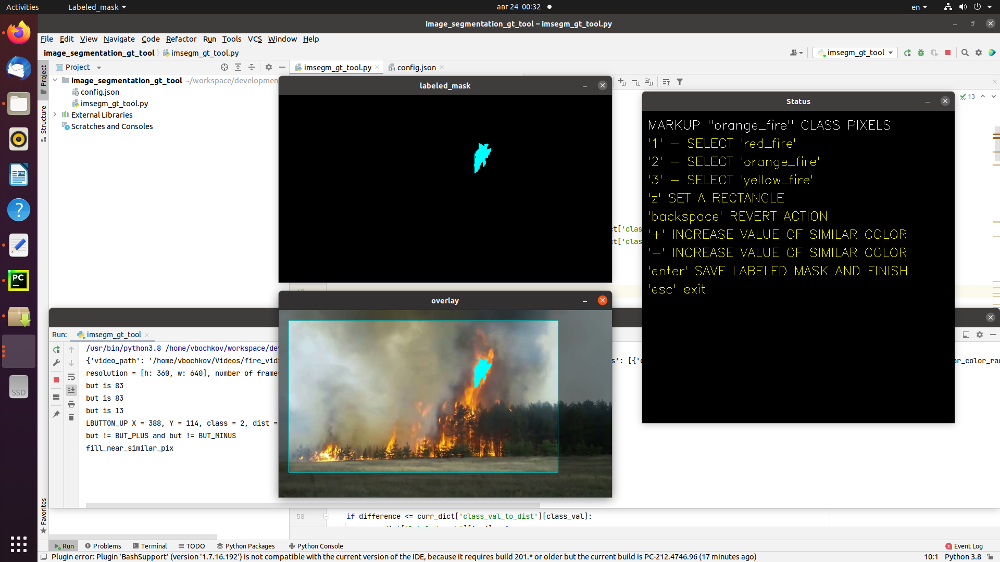

# Image segmentation markup application

The application is good choice to prepare Image segmentation or Object detection
ground truth data by your mouse. Instead of selecting one pixel it takes the color of pointed pixel
and marking up all its neighbours around recursively.

The app is based on several drawable windows.
The first one is Hints window to easy use by mouse and keyboard
The second one is labeled mask which is black initially and is filled with selected areas
The image going to be marked up with current overlay. This window is actually takes user interactions (mouse clicks)

# Requirements

`sudo pip3 install -r requirements.txt`

Note: OpenCV is not included into requirements, because from the pip box it build without highgui support
Please install OpenCV manually

# Run

cmd-line:
`python3 ./imsegm_gt_tool.py`

use config.json file to specify necessary parameters.

# Parameters

#Input data:
1. Video with timestamp:
`
"video_path": "$path_to_your_video"
"video_time": "MM:SS"
`
2. Video with frame number:
`
"video_path": "$path_to_your_video"
"frame_num": INT
`
3. Image
`"image_path": "$path_to_your_image"`

# Classes in your task

The list of available classes in your task.
Class must have following fields:
1. `"class_id": INT` - class number which will be applied to mask
2. `"class_name": STRING` - class name used in UI
3. `"marked_up_color": [UINT8, UINT8, UINT8]` - BGR color used in overlay
4. `"near_color_rad": FLOAT` - L2 norm value of deviation relatively to pointed pixel color to select near pixels in within this range
